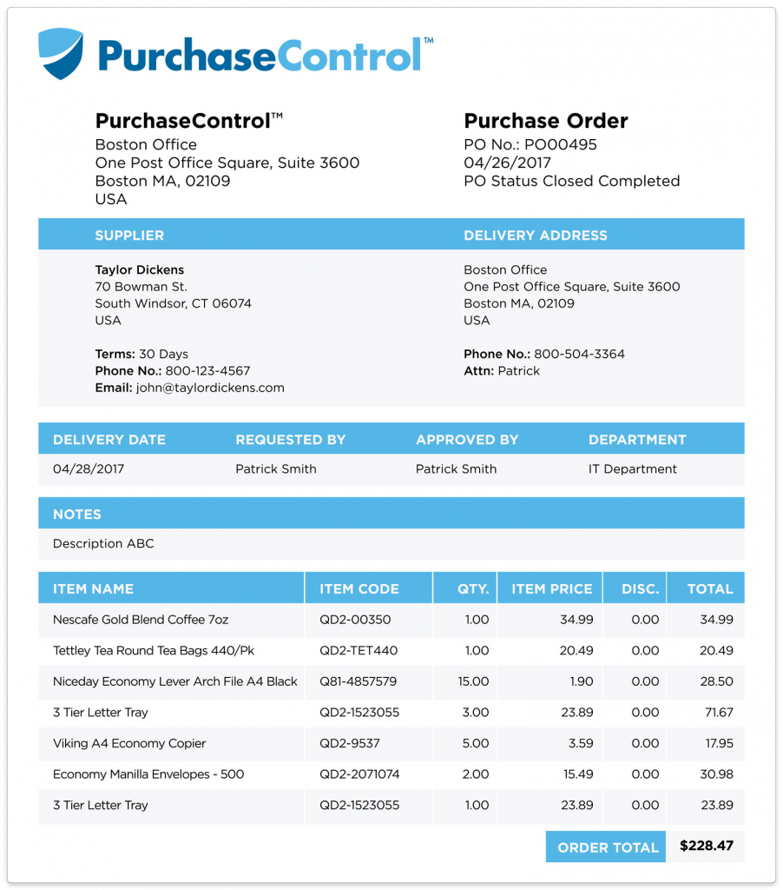

# 📄 customer-doc-ai-classifier

Fine-tune **Google ViT (Vision Transformer)** for customer document classification based on the first page of each document.
This project is designed to classify Purchase Orders (POs) or other customer-specific documents by training on a folder-structured dataset.

---

## 🚀 Features

- ✅ **Simple folder-based dataset input** (no CSV/annotation files required)
- ✅ **Fine-tunes `google/vit-base-patch16-224` using Hugging Face Transformers**
- ✅ **Automatic train/validation split (90/10)**
- ✅ **Saves best model & processor for later inference**
- ✅ **Works on GPU or CPU (CUDA auto-detected)**
- ✅ **Easy-to-use CLI for training & prediction**

---


## 🖼️ Prepare Dataset from PDFs

If your data is currently in **PDF format**, you can convert it into images before training.

### Input PDF Structure:

Data/

├── CustomerA/

│   ├── po1.pdf

│   ├── po2.pdf

├── CustomerB/

│   ├── po1.pdf

## 📂 Dataset Structure

Your dataset should follow this structure:

Datasets/

├── CustomerA/

│   ├── doc1.jpg

│   ├── doc2.jpg

├── CustomerB/

│   ├── doc1.jpg

│   ├── doc2.jpg

- Each folder represents a **class** (customer name).
- You can use `.jpg`, `.jpeg`, or `.png` images.


### Convert PDFs to Images:

```bash
python prepare_dataset.py --pdf_root Data --output_root Datasets --dpi 200
```

---

## 🔧 Installation

```bash
git clone https://github.com/Ahmad10Raza/customer-doc-ai-classifier.git
cd customer-doc-ai-classifier.git

# Create and activate virtual environment (recommended)
python -m venv venv
source venv/bin/activate  # on Linux/Mac
venv\Scripts\activate     # on Windows

# Install dependencies
pip install -r requirements.txt
```

---

## 🏋️‍♂️ Training

Run the training script with your dataset directory:

```bash
python train_vit.py --data_dir Datasets --epochs 10 --batch_size 4 --lr 5e-5 --output_dir ./vit-customer-model
```

### Arguments:

| Argument         | Description                                                       |
| ---------------- | ----------------------------------------------------------------- |
| `--data_dir`   | Path to dataset directory (required)                              |
| `--epochs`     | Number of training epochs (default:`10`)                        |
| `--batch_size` | Training batch size (default:`4`)                               |
| `--lr`         | Learning rate (default:`5e-5`)                                  |
| `--output_dir` | Directory to save model & logs (default:`./vit-customer-model`) |

After training, the final model is saved at:

`<output_dir>/final/`

---

## 🔮 Inference (Prediction)

Use the provided `predict.py` to classify new documents:

```bash
python predict.py path/to/test_image.jpg
```

Example output:

```
Predicted Label: CustomerB
```

---

## 📊 Example Results

| Customer                     | Sample Image                                                                        | Predicted                        |
| ---------------------------- | ----------------------------------------------------------------------------------- | -------------------------------- |
| HealthCare Fright and Supply |  | ✅ HealthCare Fright and Supply |
| PurchaseControl              |                    | ✅ PurchaseControl              |

---

## 🛠️ Tech Stack

* [PyTorch](https://pytorch.org/)
* [Hugging Face Transformers](https://huggingface.co/docs/transformers/index)
* [Evaluate](https://huggingface.co/docs/evaluate/index)
* [Pillow](https://python-pillow.org/)

---

## 📜 License

This project is licensed under the **MIT License** – you are free to use, modify, and distribute it with attribution.

See the [LICENSE](https://chatgpt.com/c/LICENSE) file for details.

---

## 💡 Future Improvements

* Add **data augmentation** (random crop, flip, color jitter)
* Add **mixed precision training** for faster GPU performance
* Support **multi-label classification**
* Integrate **Hugging Face Hub** for model sharing

---

## 🤝 Contributing

Pull requests are welcome!

If you find a bug or want a feature, open an [issue](https://github.com/%3Cyour-username%3E/vit-customer-doc-classifier/issues).

---

## ⭐ Show Your Support

If you find this useful, consider giving the repo a ⭐ on GitHub!
